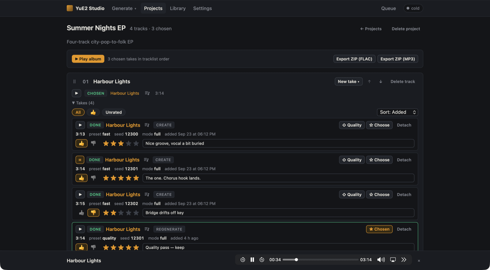

# YuE2 Studio documentation

YuE2 Studio is a local web app for making full songs with [YuE2-3B](https://huggingface.co/m-a-p/YuE2-3B)
on an Apple Silicon Mac. You describe a style, write lyrics, and the studio plans a score, generates the song
and plays it back in your browser. Everything runs on your machine.

## User guide

| Page | What it covers |
|---|---|
| [Getting started](getting-started.md) | Requirements, installation, downloading the weights, starting the server, your first song, a tour of the UI |
| [Creating songs](creating-songs.md) | The Create page: style, lyrics and section tags, modes, presets, seeds, CFG, variations, supplying a score, the results column |
| [Queue, library and songs](library-and-songs.md) | The job queue, the library, the song page, the player, editing a score and regenerating, downloads |
| [Covers](covers.md) | Turning an existing recording into a new song: tasks, clips, *Continue from the clip* |
| [Hum to song](hum-to-song.md) | Humming or recording a melody and growing a whole song from it, with the optional prosody adapter |
| [Projects and albums](projects.md) | Tracklists, takes, ratings, choosing a final take, ⇧ Quality, album playback and ZIP export |
| [Ask Claude](ask-claude.md) | Letting Claude fill in the title, style and lyrics from a one-line description |
| [LoRA adapters](lora-adapters.md) | Adding, stacking and scaling adapters for the planner and the acoustic model |
| [Settings, memory and speed](settings.md) | Every setting, low-memory mode, fast numerics, the engine panel, measured timings |
| [Troubleshooting](troubleshooting.md) | Error messages and what to do about them |

## Reference

| Document | What it covers |
|---|---|
| [HTTP API](API.md) | The JSON + Server-Sent Events contract the UI uses (also browsable at `/api/docs` while the server runs) |
| [Design plan](PLAN.md) | The original architecture and design decisions |
| [Development](development.md) | Running the tests, the fake engine, the mock API, code layout |

## At a glance

| | |
|---|---|
|  |  |
| **Library** — every finished song, with filters, downloads and play buttons | **Song page** — the planned score, rendered and editable |
|  |  |
| **Projects** — takes per track, ratings, a chosen take for the album | **Queue** — live progress, the score appears as it is planned |

The screenshots in these docs come from a demo library of original songs. Generation times and durations
shown are typical of an M5 Max with 48 GB.
