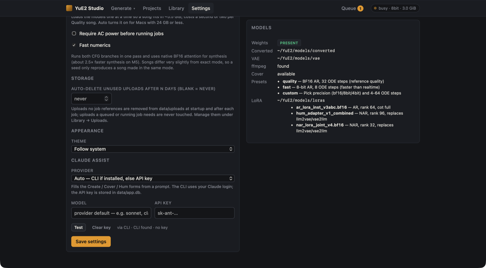

# Ask Claude

Create, Cover and Hum each have an **Ask Claude** box at the top of the form. Describe the song you want and
Claude fills in the form for you.


## Using it

1. Type a description, for example:

   ```text
   a bittersweet synth-pop duet about a long-distance call, 100 BPM
   ```

2. Click **Ask Claude**, or press **⌘ Enter** (**Ctrl Enter** on Windows and Linux).
3. Claude fills in the **title**, **style tags** and **section-tagged lyrics**. On Create it also sets the
   **mode** and **CFG scale**. Under the box you get Claude's one-line tip ("if it comes out X, change Y"),
   the list of fields it changed, and the provider, model and time taken.
4. **Undo** puts back what was in the form before; click it again (**Redo**) to re-apply Claude's version.

Tick **Refine what's already in the form** to send your current fields along. Claude then edits them instead of
starting over, which is useful for "make the chorus shorter" or "same song, but in Spanish".

## Providers

Choose the provider in **Settings → Claude assist**. `Auto` (the default) uses the CLI if it is installed,
otherwise an API key.



| Provider | Setup | Notes |
|---|---|---|
| **`claude` CLI** | Install [Claude Code](https://claude.com/claude-code) and log in. Nothing else. | The studio runs `claude -p` with your login. No MCP servers, skills or hooks are loaded, and an exported `ANTHROPIC_API_KEY` is not passed through, so the call is billed to the login. The model is the CLI's default unless you set **Model** (for example `haiku` or `sonnet`). |
| **Anthropic API** | Paste an API key in Settings, or export `ANTHROPIC_API_KEY` before starting the server (Settings wins when both are set). | Default model `claude-sonnet-5`. **Test** checks the connection. |
| **Off** | | Hides the box everywhere. |

The tag in the corner of the box shows the active provider (`CLI` or `API`). When neither is available it reads
`unavailable`, and the box stays visible but disabled, with a hint saying why.

## What is sent

Only the system prompt, the page name (create, cover or hum), your request, and, with **Refine** on, the current
title, style, lyrics, mode and CFG. No audio and no job history.

The API key is stored **in plain text** in `data/app.db`. It is never returned by the API (`GET /api/settings`
only reports whether one is stored). **Clear key** removes it.

The system prompt is `yue2_studio/assist_prompt.md`, and the reply is constrained to a JSON schema, so nothing
needs parsing.
