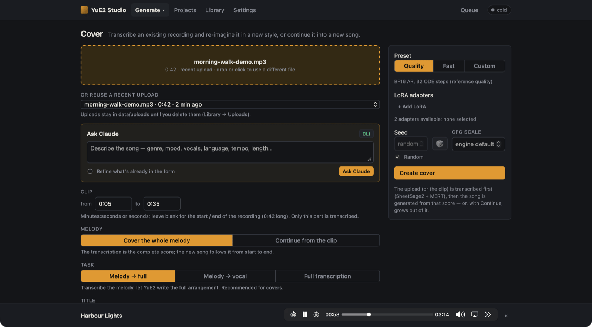
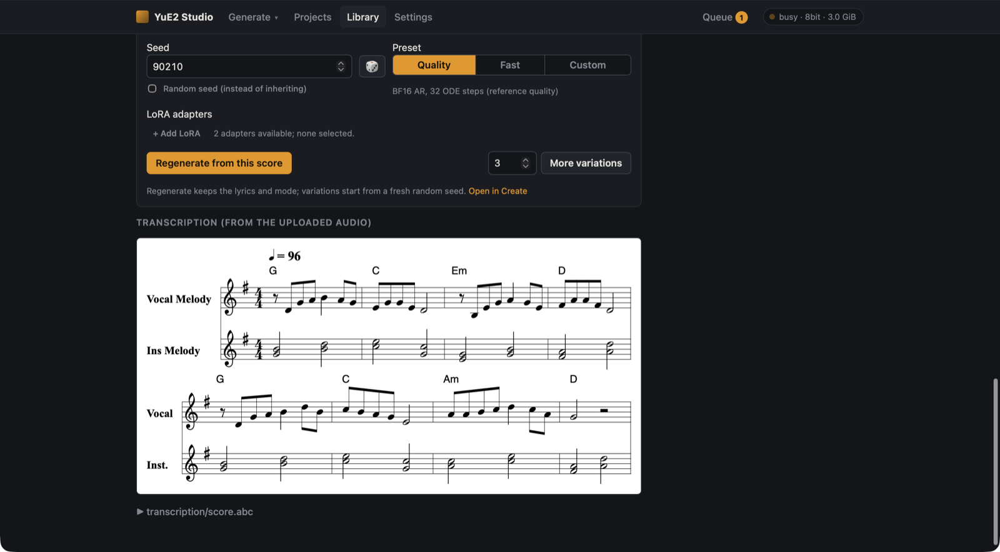

# Covers

**Cover** (`#/cover`) turns an existing recording into a new song. The studio transcribes the recording's
melody (and optionally its chords) into a score, then generates a song from that score in the style and with
the lyrics you give it.

Cover needs the transcription models and ffmpeg: run `uv run python scripts/setup.py --with-cover`. Until
they are present the page is disabled and says what is missing, as do **Settings → Models** and
`GET /api/status`.

## Steps

1. **Choose the audio.** Drop a file on the box or click it: `mp3`, `wav`, `flac`, `m4a` or `ogg`, up to
   200 MB. Or pick one you uploaded before from **Or reuse a recent upload**.
2. **Clip** (optional). Enter a start and end (`m:ss` or seconds) to transcribe only that part. Leave both
   blank for the whole recording.
3. **Melody.** Choose what the transcription is for (below).
4. **Task.** Choose what to transcribe (below).
5. **Title** defaults to the file name. **Style** and **Lyrics** are required, as on Create.
6. Pick a **Preset**, **LoRA adapters**, **Seed** and **CFG scale** as on [Create](creating-songs.md), then
   **Create cover**.

The job first shows a **Transcribe** stage, then the usual Plan / Semantic / Synthesize / Decode.

## Task

| Task | Transcribes | Generates with mode |
|---|---|---|
| **Melody → full** (default, recommended) | melody and chords | `melody` |
| **Melody → vocal** | the vocal melody only | `melody` |
| **Full transcription** | a full score | `full` |

## Melody

- **Cover the whole melody** (default). The transcription is the complete score, and the new song follows it
  from start to end.
- **Continue from the clip.** The recording works like a hum: the clip's melody is transcribed, its trailing
  rests are trimmed, and the planner *continues* that open score. The song opens with the clip's melody and
  YuE2 writes the rest. This needs a melody task (**Full transcription** is disabled) and suggests a 30-second
  clip; 15–30 seconds works best.

Only the notes are transcribed, never the words. With *Continue from the clip*, write lyrics for the
**whole** song: the first lines are sung over the clip's melody, so give them roughly the original's syllable
count. There is no pitch-contour adapter here, because the hum adapter's pitch tracker needs a single voice,
not a full mix.

## The result

The song page shows the result's score and, under it, the transcription of your recording, so you can compare
them. With *Continue from the clip*, that section shows the opening the planner continued.

- **Regenerate from this score** works as for any song.
- **More variations** of a cover reuse its transcription, so every variation keeps the melody.

## Licence note

A cover generated from someone else's recording is a derivative of that recording. Check that you have the
rights you need, and remember that the YuE2 weights are licensed for non-commercial use only (see the main
[README](../README.md#licences-and-attribution)).
