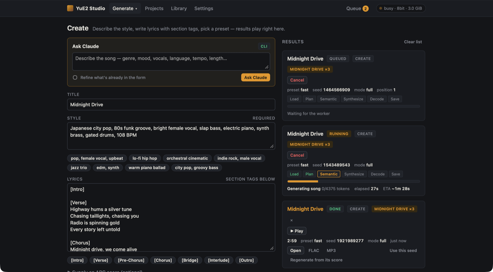
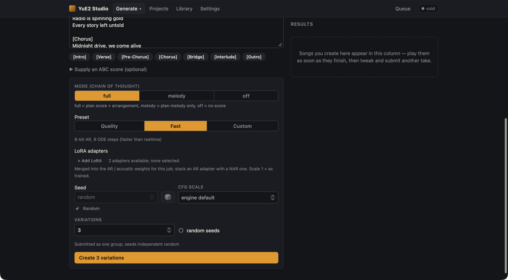

# Creating songs

**Create** (`#/create`) is where you write a song from scratch: a style description, lyrics, and a few
generation choices. It is built for iterating: submitting keeps you on the page with the form intact, and each
job shows up in the **Results** column beside it.



## How a song is made

YuE2 generates a song in four stages, and the progress chips on every job card follow them:

| Stage | Chip | What happens |
|---|---|---|
| Plan | **Plan** | The model writes an ABC score: melody, chords, sections, tempo. You can watch it appear. |
| Semantic | **Semantic** | It writes the song as audio tokens (25 per second of music), guided by the score, style and lyrics. |
| Synthesize | **Synthesize** | A flow-matching model turns the tokens into acoustic latents. |
| Decode | **Decode** | The audio decoder produces 48 kHz stereo, saved as FLAC. |

**Load** (loading or merging models) comes first and **Save** (writing files) last; both are usually a
fraction of a second.

## The form

### Title

Optional. It is only a display name; the model never sees it. You can rename a song later by clicking its
title on the song page.

### Style

Free text describing the genre, instruments, voice, mood and tempo. The genre chips under the box append common
tags. Descriptive, comma-separated phrases work best:

```text
Japanese city pop, 80s funk groove, bright female vocal, slap bass, electric piano, synth brass, gated drums, 104 BPM
```

### Lyrics

Put section tags on their own lines and the words under them. The chips under the box insert the tags:
`[Intro]`, `[Verse]`, `[Pre-Chorus]`, `[Chorus]`, `[Bridge]`, `[Interlude]`, `[Outro]`.

```text
[Verse]
Streetlights melt across the bay
Taxi radios drift and sway

[Chorus]
Harbour lights, keep burning bright
Hold this city through the night
```

Leave a tag empty for an instrumental passage, as `[Intro]` and `[Interlude]` are in
`examples/full-song.json`. For a fully instrumental track, see
[the instrumental adapter tips](lora-adapters.md#tips-for-the-instrumental-adapter).

The form is saved in your browser as you type, so a reload does not lose your draft.



### Mode

| Mode | What the model does |
|---|---|
| **full** (default) | Plans a complete score (melody, chords, structure) before writing audio. Most coherent songs. |
| **melody** | Plans only the vocal melody line, then generates audio. |
| **off** | No score. Audio is generated straight from the style and lyrics. Fastest and loosest; the song page has no score to edit. |

### Preset

| Preset | Planner precision | Synthesis steps | When to use it |
|---|---|---|---|
| **Quality** | BF16 | 32 | Final takes. About 0.55× realtime on an M5 Max. |
| **Fast** | 8-bit | 8 | Sketching and trying ideas. About 3.5× faster than realtime. |
| **Custom** | BF16, 8-bit or 4-bit | 4–64 | Anything in between. |

The default preset is set in [Settings](settings.md). Changing precision rebuilds the loaded pipeline (well
under a second); the number of steps is chosen per job.

A common workflow is to sketch several **Fast** takes, pick the best, then re-render it on Quality with one
click (**⇧ Quality**, see [Projects](projects.md#-quality)).

### LoRA adapters

Pick one or more adapters from `models/loras/` and set a scale for each (1 = as trained). See
[LoRA adapters](lora-adapters.md).

### Seed

**Random** is ticked by default, so the server picks a fresh seed each time. Untick it to type a seed or roll
one with 🎲. The same seed, request and settings give the same song, which is how *Use this seed* and
*Regenerate* reproduce a take.

### CFG scale

Classifier-free guidance strength. Leave it empty for the engine default. Higher values follow the style and
lyrics more strictly; they cost roughly twice the time in the semantic stage because the model runs two
branches per token. Values of 1.5–3 are useful with the instrumental AR adapter.

### Variations

Set **Variations** above 1 to submit several jobs at once as a group. With a fixed seed they get
`seed, seed+1, …`; with **Random** seed, or **random seeds** ticked, each gets an independent random seed.
The button changes to **Create N variations**. Groups get a badge (`MIDNIGHT DRIVE ×3`) and a `VAR 2/3`
number on each song, and the Library can filter by group.

### Supply an ABC score (optional)

Paste an ABC score, or load a `.abc`/`.txt` file, to skip planning; the model follows your score. This needs
mode **full** or **melody**. The easiest way to get a score to start from is the song page of an earlier song
(see [editing a score](library-and-songs.md#editing-the-score-and-regenerating)).

## The results column

Each job you submit from this page appears at the top of **Results**:

- **While queued**: its position and a **Cancel** button.
- **While running**: the stage chips, a progress bar, tokens per second, elapsed time and an ETA. The score
  streams in while it is planned; it is collapsed by default to keep several cards compact, and **Show score**
  expands it.
- **When finished**: **▶ Play**, the duration, and shortcuts:
  - **Open** — the song page.
  - **FLAC** / **MP3** — downloads.
  - **Use this seed** — copies the seed into the form (and unticks Random) so you can change something else
    and keep the rest.
  - **Regenerate from its score** — opens the song page, where you can edit the score and regenerate.

The last 20 results stay in the column across reloads. **Clear list** or a card's ✕ only removes them from the
column; the songs stay in the Library.

## Making a take for a project

When you start from a project's **New take ▾ → Create**, the page shows a banner naming the project and track,
pre-fills the title with the track name, and files the result as a take of that track. See
[Projects](projects.md).

## Writing good requests

- Put the tempo in the style (`96 BPM`) and name the lead voice (`breathy female vocal`, `warm male vocal`).
- Match the syllable count of lines that should share a melody.
- If a take is close, keep the seed and change one thing. If it is off, re-roll the seed before rewriting the
  prompt.
- For a hand-made or edited melody, supply the score and use **melody** or **full**.

[Ask Claude](ask-claude.md) writes requests along these lines for you.
