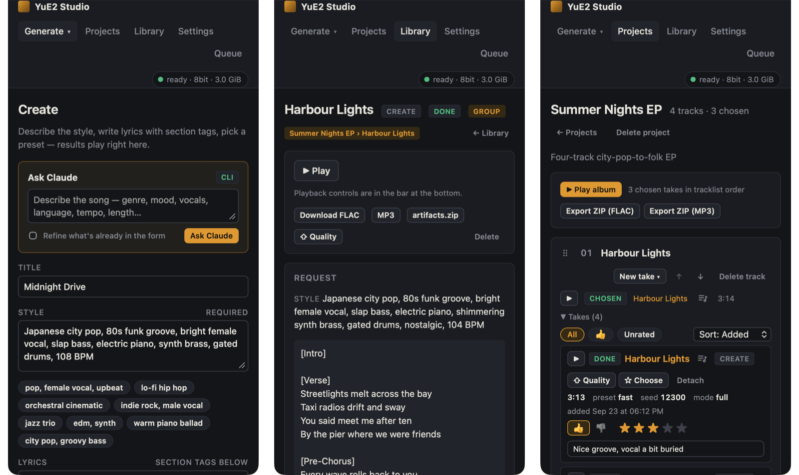

# Getting started

This page takes you from a fresh checkout to your first song, then gives a quick tour of the interface.

## What you need

| | |
|---|---|
| Mac | Apple Silicon with **16 GB of memory or more**. A 3-minute song peaks at about 10 GiB of unified memory, or about 5.3 GiB in low-memory mode (turned on automatically on Macs with 24 GB or less). 32 GB or more runs everything at full speed. |
| macOS | **14.2 or newer** on M1–M4; **26.2 or newer** on M5. |
| Tools | [`uv`](https://docs.astral.sh/uv/) and `ffmpeg`: `brew install uv ffmpeg`. ffmpeg is needed for MP3 export, reading uploads and covers. |
| Disk | About 13 GB for the song models, plus 2.7 GB more for covers and hum-to-song. |
| Browser | Any current browser. The page loads [abcjs](https://github.com/paulrosen/abcjs) from cdnjs to draw scores, so it needs an internet connection for that. |

Python 3.12 is downloaded by `uv` for you. Intel Macs and Rosetta Python are not supported.

## Install

```bash
uv sync
```

This creates `.venv` with Python 3.12 and the MLX engine ([mlx-Yue](https://github.com/ianiv/mlx-Yue/tree/perf),
pinned in `pyproject.toml`).

## Download the models

```bash
uv run python scripts/setup.py --with-cover
```

This downloads the pre-converted MLX weights into `models/` and ends with a *doctor* report that checks macOS,
Metal, ffmpeg and the files it just fetched.

| Flag | Effect |
|---|---|
| *(none)* | Song models only: the generator (`models/converted`) and the audio decoder (`models/vae`). Enough for Create. |
| `--with-cover` | Also the transcription models (SheetSage2 and MERT) needed by **Cover** and **Hum**. |
| `--no-verify-hashes` | Skip the hash check after downloading. |
| `--skip-download` | Only print the doctor report. |

You can run it again later with `--with-cover` if you start without covers.

## Start the studio

```bash
uv run yue2-studio --open
```

The server listens on <http://127.0.0.1:8765> and `--open` opens it in your browser. It starts instantly: the
models load on the first job (under a second, they are memory-mapped) and stay loaded after that.

The server has no login, so keep it on `127.0.0.1` unless you know who can reach your machine. Other options
are listed under [Command line](#command-line) below.

## Make your first song

1. Open **Create** (the page the studio opens on).
2. Type a **Style**, for example `warm piano pop, expressive female vocal, 88 BPM`, or click one of the genre
   chips under the box.
3. Write **Lyrics** with section tags on their own lines:

   ```text
   [Verse]
   Folded wishes on the sill
   Sent them out when the air was still

   [Chorus]
   Paper planes, carry my name
   Through the sun and through the rain
   ```

4. Leave the mode on **full** and pick the **Fast** preset for a quick first result.
5. Click **Create song**.

The job appears in the **Results** column next to the form. You can watch it plan the score, generate and
decode; when it finishes a **▶ Play** button appears. A 3-minute song takes about a minute on the Fast
preset and about a minute and a half on Quality on an M5 Max (see [measured timings](settings.md#measured-timings)).

Not sure what to write? The **Ask Claude** box at the top of the form fills in the title, style and lyrics
from a one-line description. See [Ask Claude](ask-claude.md).

## A tour of the interface


The header is the same on every page:

| Item | Where it goes |
|---|---|
| **Generate ▾** | A menu with the three ways to make a song: **Create** (style + lyrics), **Cover** (from a recording) and **Hum** (from a hummed melody). |
| **Projects** | Albums and soundtracks: tracklists with several takes per track. |
| **Library** | Every finished song. |
| **Settings** | Defaults, memory, theme, Ask Claude, and the engine status panel. |
| **Queue** | Jobs waiting or running. The orange badge counts them. |
| Engine pill | The engine's state: `cold` (models not loaded), `loading`, `ready` or `busy`, with the loaded precision and memory in use. |

Every page works at phone width and follows the system light or dark theme (you can override it in Settings).



The player bar at the bottom of the window is shared by every play button. It keeps playing while you move
between pages, and it remembers the last song when you reload.

## Where your files go

Everything the studio makes lives next to the code:

| Path | Contents |
|---|---|
| `data/app.db` | The SQLite database: jobs, projects, settings. |
| `data/songs/<job id>/` | One folder per song: `song/audio.flac`, the score, the plan, `summary.json`, and for covers and hums the transcription. |
| `data/uploads/` | Recordings uploaded for covers and hums. |
| `models/` | Downloaded weights; drop LoRA adapters into `models/loras/`. |

Set `YUE2_STUDIO_HOME` to keep `data/` and `models/` somewhere else. By default the home is the main git
checkout, even when running from a worktree under `.worktrees/`, so worktrees share the downloaded weights.

## Command line

```
uv run yue2-studio [--host 127.0.0.1] [--port 8765] [--open] [--fake] [--fake-delay 0.3]
                   [--reload] [--log-level info]
```

| Flag | Meaning |
|---|---|
| `--host`, `--port` | Address to listen on (default `127.0.0.1:8765`). |
| `--open` | Open the UI in the default browser once the server is up. |
| `--fake` | Run with a scripted stand-in engine: no models and no GPU, jobs finish with silent audio. Handy for trying the UI. |
| `--fake-delay` | Seconds between the fake engine's progress events (default 0.3). |
| `--reload` | Restart on code changes (development). |
| `--log-level` | Server log level (default `info`). |

Next: [Creating songs](creating-songs.md).
