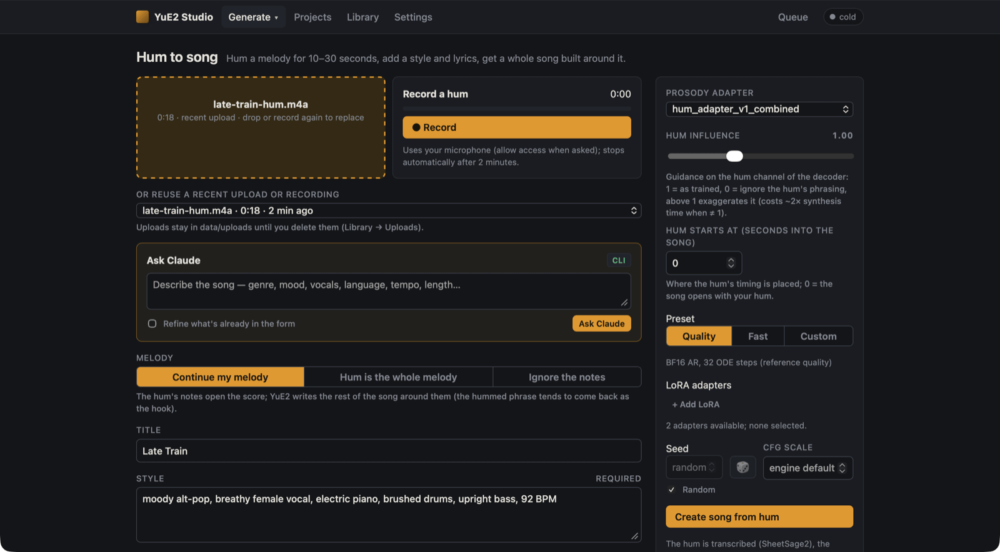
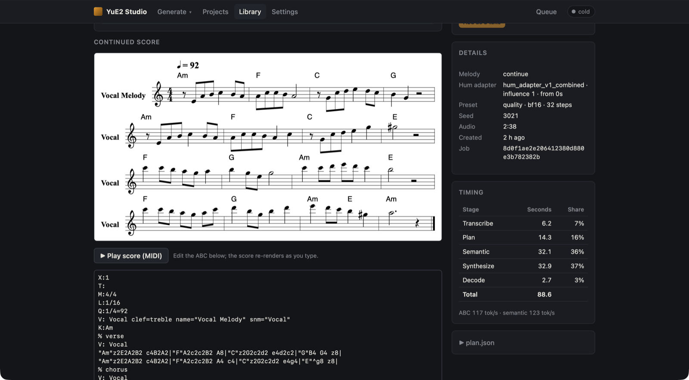

# Hum to song

**Hum** (`#/hum`) grows a whole song out of a melody you hum. Hum for 10–30 seconds, add a style and lyrics,
and the studio builds a song around your tune.



Hum needs the same models as [Covers](covers.md) (`scripts/setup.py --with-cover`), ffmpeg, and `librosa`
(installed by `uv sync`). The optional prosody adapter is a separate download (below).

## Record or upload a hum

- **● Record** records from your microphone right in the page (Safari, Chrome and Firefox). Allow microphone
  access when the browser asks. The page must be opened as `localhost`/`127.0.0.1` or over HTTPS for the
  browser to allow the microphone. Recording stops by itself after 2 minutes.
- Or drop a recording on the box (`mp3`, `wav`, `flac`, `m4a`, `ogg`, `webm`), or reuse a recent upload.

The transcriber needs something voice-like: a real hum works, a synthesised tone does not (the job fails early with "no notes").

## Melody

| Option | What happens |
|---|---|
| **Continue my melody** (default) | Your hum is transcribed into the *opening* of the score and the planner keeps writing: new sections and an ending, in your hum's key and range. The hummed phrase tends to come back as the hook. |
| **Hum is the whole melody** | The transcription is the complete vocal line, like a cover. |
| **Ignore the notes** | The planner writes its own score; only the prosody adapter uses your hum. Needs an adapter. |

Write lyrics for the whole song. With *Continue my melody*, the first lines are sung over your hum's phrase.

## Prosody adapter (optional)

The score only captures *which* notes you hummed. The prosody adapter also carries *how* you hummed them:
timing and phrasing. It comes from [Mothersuperior/YuE2-hum-to-song](https://huggingface.co/Mothersuperior/YuE2-hum-to-song);
put `hum_adapter_v1_combined.safetensors` in `models/loras/` and it appears under **Prosody adapter**.

| Control | Effect |
|---|---|
| **Prosody adapter** | `None — score continuation only`, or a hum adapter from `models/loras/`. |
| **Hum influence** | Guidance on the decoder's hum channel. 1 = as trained, 0 = ignore the hum's phrasing, above 1 exaggerates it. Any value other than 1 roughly doubles synthesis time. |
| **Hum starts at** | Seconds into the song where the hum's timing is placed. 0 = the song opens with your hum. |

`hum_adapter_v1.safetensors` (the non-combined file) must be stacked on `nar_lora_joint_v4.bf16`: add that one
under **LoRA adapters**. The hum adapter is always merged last.

How it works: the studio tracks your hum's pitch, builds a sine "carrier" that follows the pitch and loudness,
encodes it with the audio VAE and feeds it into the acoustic model at four depths.

## The result

The song page shows the **Continued score** and, under it, **Your hum**: the open score the planner
continued. **Details** lists the melody option and the adapter with its influence and offset.



**More variations** of a hum keep the continued score. The hum's files (`hum.abc`, `carrier.flac`,
`carrier_latents.npy`, `prosody.json`) are in `data/songs/<id>/hum/` and in the song's ZIP.

Hum songs have no **⇧ Quality** button: a regenerate would drop the hum carrier.

## From the command line

```bash
uv run python scripts/hum_smoke.py --audio my-hum.m4a --adapter hum_adapter_v1_combined
```

`--analyse-only` just tracks the pitch and encodes the hum, without generating a song.
