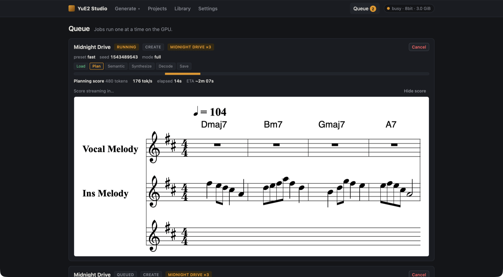
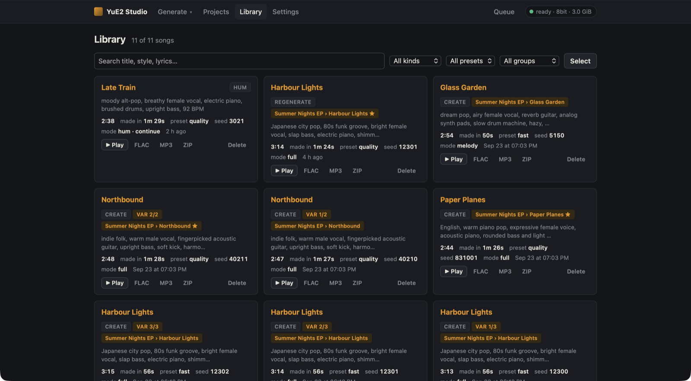
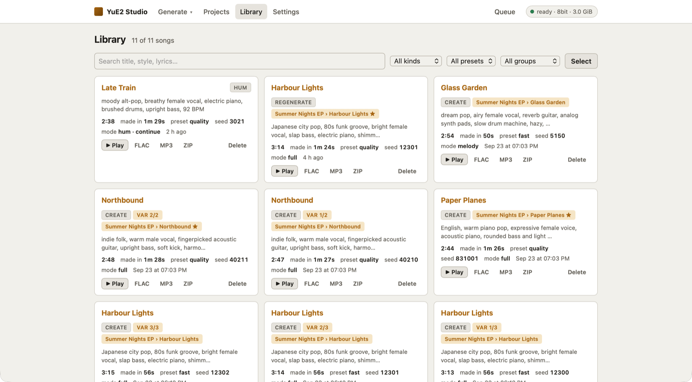
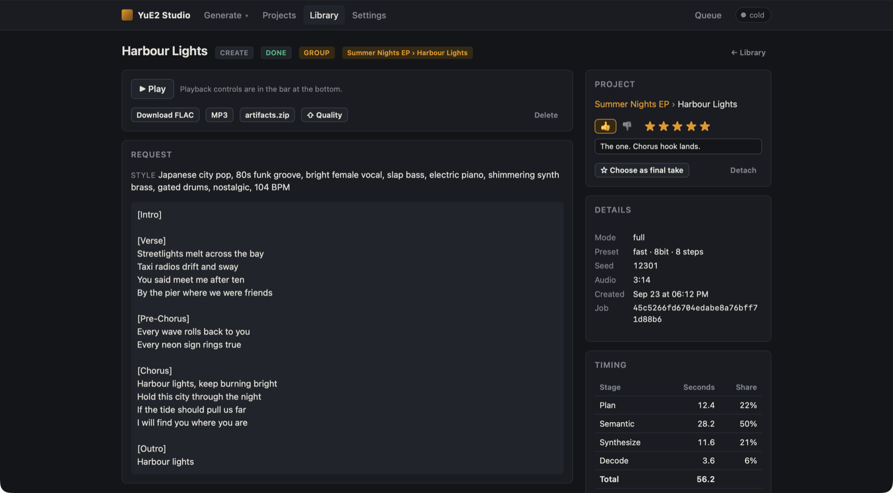
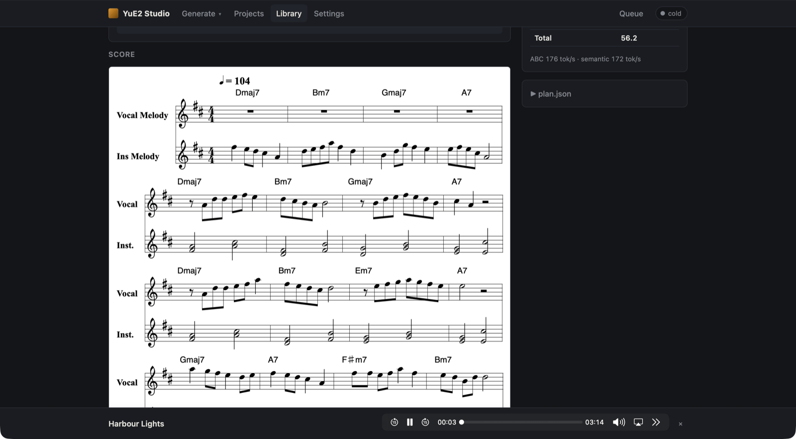
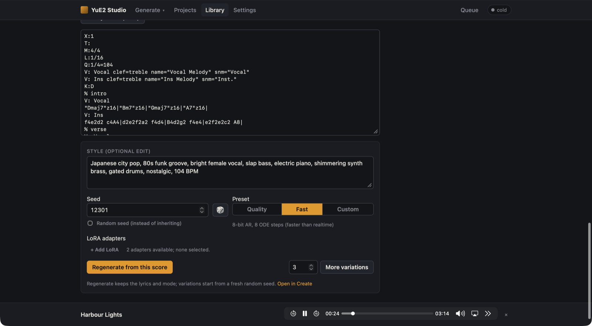

# Queue, library and songs

## Queue

**Queue** (`#/queue`) lists the jobs that are waiting or running. The badge on the header link counts them.

Jobs run **one at a time**, because the GPU takes one workload per process. Each card shows:

- the stage chips (**Load → Plan → Semantic → Synthesize → Decode → Save**), a progress bar, tokens per
  second, elapsed time and an ETA;
- the score, rendered as it is being planned (**Hide score** folds it away);
- the queue position of waiting jobs;
- **Cancel**. A queued job is cancelled at once. A running job stops at the next token, synthesis step or
  decode chunk, and the worker moves on to the next job.

When a job finishes it leaves the queue and appears in the Library. If the server stops while jobs are
waiting, they are queued again on the next start; a job that was running is marked failed ("server
restarted…") and can simply be submitted again.

## Library

**Library** (`#/library`) shows every finished song, newest first.

Each card has the title, badges for the kind (`CREATE`, `REGENERATE`, `COVER`, `HUM`), variation group
(`VAR 2/3`) and project track (`Summer Nights EP › Harbour Lights`, with ★ when it is the chosen take), the
style, and:

| | |
|---|---|
| duration | Length of the song. |
| made in | Total generation time. Hover it for the per-stage split and the realtime factor. |
| preset, seed, mode | How it was made. |
| **▶ Play** | Plays it in the player bar. |
| **FLAC**, **MP3**, **ZIP** | Downloads. MP3 is transcoded the first time you ask for it (needs ffmpeg). The ZIP holds the whole song folder: audio, score, plan, request and timing. |
| **Delete** | Removes the song and its files. |

At the top:

- **Search** matches title, style and lyrics.
- **All kinds / All presets / All groups** filter the grid. Clicking a `VAR n/N` badge shows just that group.
- **Select** turns on multi-select. With songs selected you can **Delete selected** or **Add to project…**,
  which files them as takes of a track you pick.
- **Load more** appears when there are more than 60 songs.

Further down:

- **Failed and cancelled** lists jobs that did not finish, with the error, and **Clear all**.
- **Uploads** lists the recordings in `data/uploads/` that covers and hums used. **Delete selected** and
  **Clear unused** free space; uploads that a queued or running job still needs are never deleted. Settings
  can also clear unused uploads automatically after a number of days.

The library follows your system's light or dark theme, or the one you pick in Settings:

## The song page

Click a title anywhere to open its song page (`#/song/<id>`).

**Header.** The title (click it to rename), the kind and status, and links to the song's variation group,
its parent (for a regenerated song) and its project track.

**Playback and downloads.** **▶ Play**, **Download FLAC**, **MP3**, **artifacts.zip** and **Delete**. Songs
made with the Fast preset also get **⇧ Quality**, which re-renders the song on the Quality preset from its
own score and seed (see [Projects](projects.md#-quality)).

**Request.** The style and the full lyrics.

**Project** panel. Rate the song (👍 / 👎, 1–5 stars, a note), make it the track's final take, or detach it.
A song that is not in a project yet gets a project/track picker and **Add as a take**.

**Details.** Mode, preset (with precision and steps), LoRA adapters, seed, duration, creation time and job id.
Covers also show the task and source clip; hums show the melody option and hum adapter.

**Timing.** Seconds and share per stage, total time, and the planning and semantic token rates. `plan.json`
below it is the engine's plan for the song.

### The score

The **Score** section draws the song's ABC score (melody, instrument line and chord symbols). **▶ Play score
(MIDI)** plays the score with a General MIDI synthesiser so you can hear the plan without the vocals. The
first time you use it, the browser downloads soundfonts from `paulrosen.github.io`.

Songs made with mode **off** have no score.

### Editing the score and regenerating

Under the rendered score is the ABC text. Edit it and the score re-renders as you type. Then:

- **Style (optional edit)** — change the style for the new take, or leave it.
- **Seed** — inherited from this song by default, so only your score edit changes the result. Tick
  **Random seed (instead of inheriting)** for a fresh roll.
- **Preset** and **LoRA adapters** — default to this song's.
- **Regenerate from this score** — submits a `regenerate` job with the edited score, the same lyrics and mode.
  The new song links back to this one as its parent. If this song was in a project track, the new one is added
  to the same track.
- **More variations** — submits N new takes of this song's request (default 3) with consecutive seeds from a
  fresh random start, the same preset and LoRAs, in the same project track. A plain Create song re-plans its
  score; a cover keeps its transcription and a hum keeps its continued score.
- **Open in Create** — pre-fills the Create form with this song's request so you can change anything.

Things you can do in the ABC text: move notes, change chords (`"Am"`), change the tempo (`Q:1/4=96`),
transpose with the key (`K:`), or cut and repeat sections. Keep the voice layout (`V: Vocal`, `V: Ins`)
the model wrote.

### Covers and hums

Covers show the transcription of your recording under the result's score, and hums show the score of your hum
(the opening the planner continued). See [Covers](covers.md) and [Hum to song](hum-to-song.md).

## The player

Every play button feeds the one player bar at the bottom of the window. It uses your browser's audio
controls (play/pause, seek, time, volume), plus **⏮ / ⏭** when an album is playing. Click the song name to open its page and **✕** to stop and hide
the player. Playback continues while you move between pages, and the last song is remembered across reloads.
