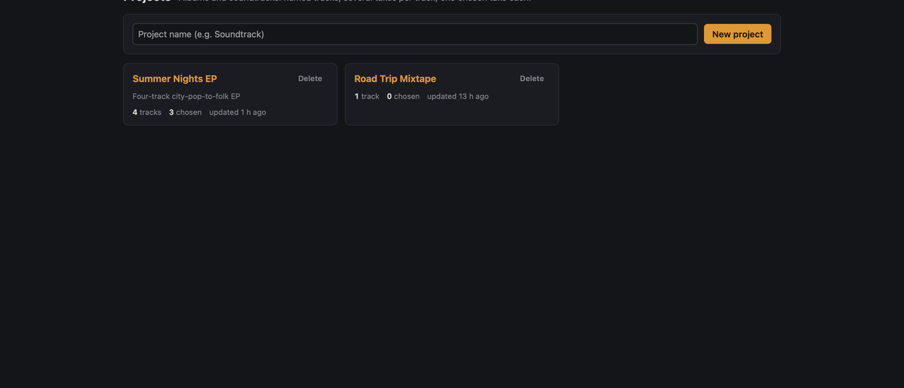

# Projects and albums

A **project** is an album, EP or soundtrack: an ordered tracklist of named **tracks**. Each track collects
**takes** (songs you generated for it), you rate them, and you **choose** one take per track as the final
version. The project then plays and exports as an album.

## Create a project

On **Projects** (`#/projects`), type a name and click **New project**. On the project page (`#/project/<id>`):

- Click the name to rename it, and **Add a description…** to describe it.
- Type a track name at the bottom and click **Add track**.
- Rename a track by clicking its name. Reorder tracks by dragging the ⠿ handle, or with **↑ / ↓**.
- **Delete track** and **Delete project** only remove the tracklist. The songs stay in the Library.

## Adding takes

Each track has a **New take ▾** menu:

| Option | What it does |
|---|---|
| **Create…**, **Cover…**, **Hum…** | Opens that page with a "New take for *Project › Track*" banner and the title pre-filled with the track name (edit it to name the take differently). What you submit lands in the track, including every member of a variations group. |
| **Add from Library…** | Opens the Library in multi-select with **Add to project…** set to this track. Pick existing songs and click **Add to track**. |

You can also add a song from its song page (**Project** panel → pick a project and track → **Add as a take**).
A song belongs to at most one track. **Regenerate** and **More variations** from a take add the new songs to the
same track.

## Rating and choosing

Every take shows its status, title, kind, duration, preset, seed and mode, and:

- **👍 / 👎**, **1–5 stars** and a **note**, saved as you click or type;
- the lyrics icon: hover or focus it to see the lyrics in a popup, click to keep it open, and press Esc or
  click elsewhere to close it;
- **☆ Choose** marks the take as the track's final take (only finished takes with audio). The chosen take shows
  **★ Chosen**, a green outline, and a summary line under the track name. Click it again to unchoose;
- **Detach** removes the take from the track and keeps the song.

Above the takes, **All / 👍 / Unrated** filter them and **Sort** orders them by when they were added, stars
or thumbs. The filter and sort are one preference shared by every project. Collapse a track's **Takes** to
keep a long tracklist readable; the studio remembers which ones you collapsed.

Songs that belong to a project carry a `Project › Track` tag everywhere (★ when chosen), and the tag links
back to the project.

## ⇧ Quality

Takes made with the **Fast** preset have a **⇧ Quality** button, on the project page and on the song page.
One click re-renders the song on the Quality preset from its own score, with the same seed, style, lyrics,
title and LoRA adapters, as a new take in the same track. It only queues the job (a toast confirms, and you
stay on the page), so each click queues another Quality take.

A good loop: generate several Fast variations for a track, rate them, click **⇧ Quality** on the best, and
choose the Quality take when it is done.

Hum takes do not get the button (a regenerate would drop the hum carrier), and neither do songs made with
mode `off`, which have no score.

## Playing and exporting the album

- **▶ Play album** plays the chosen takes in tracklist order in the player bar, with **⏮ / ⏭** to skip.
  A track's ▶ plays the album from that track.
- **Export ZIP (FLAC)** / **Export ZIP (MP3)** downloads `<project>/01 Track name.flac …` plus
  `tracklist.json` and `tracklist.md`. Tracks without a chosen take are listed as missing. MP3 export needs
  ffmpeg.
