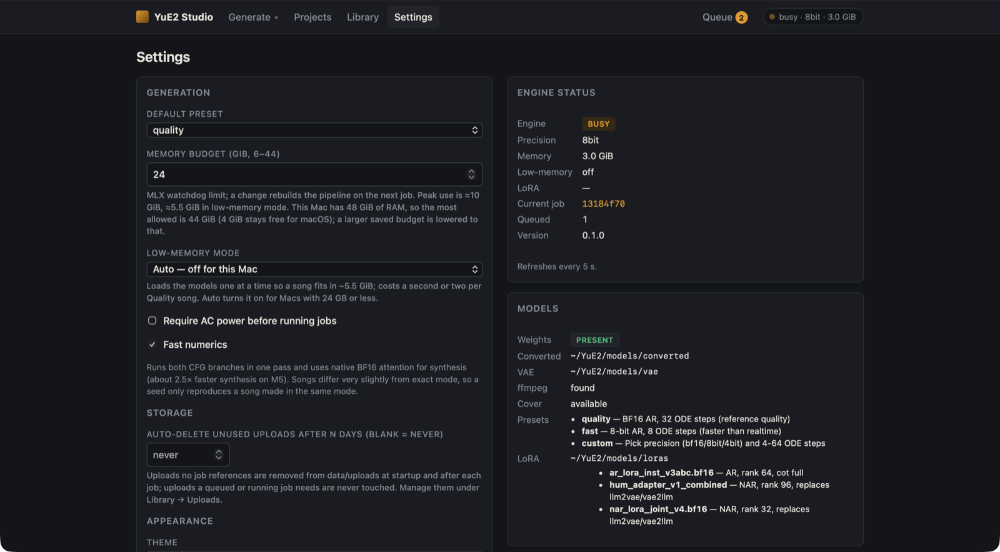

# Settings, memory and speed

**Settings** (`#/settings`) holds the studio's defaults on the left and a live view of the engine and models
on the right. Click **Save settings** at the bottom of the form to apply changes.



## Generation

| Setting | Default | What it does |
|---|---|---|
| **Default preset** | Quality | The preset the Create, Cover and Hum forms start on. |
| **Memory budget (GiB)** | 24, capped at total RAM − 4 | The limit for the engine's memory watchdog. Allowed range: 6 GiB up to total RAM − 4 GiB (6–12 on a 16 GB Mac, 6–44 on 48 GB). A larger saved value is lowered to the cap when read. A change rebuilds the pipeline on the next job. |
| **Low-memory mode** | Auto | Loads the models one at a time (below). The label says what Auto means on this Mac, e.g. *Auto — off for this Mac*. |
| **Require AC power before running jobs** | off | Stops a job if the Mac leaves mains power. |
| **Fast numerics** | on | Faster synthesis and CFG with results that differ very slightly from exact mode (below). |

## Storage

**Auto-delete unused uploads after N days** (blank = never) removes uploads that no job refers to, at startup and
after each job. Uploads a queued or running job needs are never touched. You can also clear them by hand under
**Library → Uploads**.

## Appearance

**Theme**: *Follow system*, *Light* or *Dark*.

## Claude assist

**Provider** (Auto, Claude CLI, API key, Off), **Model**, **API key**, **Test** and **Clear key**. See
[Ask Claude](ask-claude.md).


## Engine status and models

The right-hand panels refresh every 5 seconds:

- **Engine status**: state (`cold`, `loading`, `ready`, `busy`), loaded precision, memory in use, whether
  low-memory mode is active, merged LoRAs, the current job and the number queued, and the version.
- **Models**: whether the weights are present, their folders, ffmpeg, whether Cover is available (and if not,
  why), the presets, and the LoRA adapters in `models/loras/` with any reason an adapter is unusable.

The same information is available as JSON from `GET /api/status`.

## Memory

Generating a 3-minute song peaks at about **10 GiB** of unified memory, or about **5.3 GiB** in low-memory
mode. Covers release the song models before loading the transcription models (about 3 GiB) and reload them
afterwards.

### Low-memory mode

Low-memory mode loads the models one at a time. Planning and song generation use the planner as usual; then
synthesis precomputes the acoustic conditioning with the BF16 planner, releases it, and only then loads the
acoustic model; decoding releases both. A 3-minute song peaks at 5.3 GiB instead of 10.2 GiB (Fast preset,
M5 Max), in the same wall time and with bit-identical audio. It also relaxes the engine's swap,
available-memory and memory-pressure guard.

The cost is reloading the models on every job: about 0.2–2.5 seconds per Quality song. So **Auto** turns it on
only on Macs with 24 GB or less, or when the memory budget is below 14 GiB. **On** and **Off** force it.
Changing it rebuilds the pipeline on the next job, and each song's `summary.json` records whether it was used.

| Mac | Recommended |
|---|---|
| 16 GB | Low-memory mode on (Auto does it). The budget tops out at 12 GiB. Close memory-hungry apps before long batches. |
| 24 GB | Low-memory mode on (Auto does it). |
| 32 GB or more | Everything at full speed with the defaults. |

## Speed

### Fast numerics

Fast numerics (on by default) makes two changes that are numerically equivalent but not bit-identical:

- The acoustic model's attention runs as native BF16 instead of being promoted to FP32. On M5, the promoted
  path cannot use the GPU's neural accelerators and was about 60 % of synthesis time. M1–M4 already skip the
  promotion, so they gain less.
- The two CFG branches share one weight pass per token.

Without CFG the song is the same take (latents differ by 2.5–3 % RMS; audio SNR ≈ 26 dB, comparable to the
MLX port's own difference from the PyTorch reference). With CFG the sampled tokens diverge, so a seed gives a
different take than in exact mode. Untick **Fast numerics** when you need to reproduce a song made in exact
mode from its seed.

### Measured timings

M5 Max, 48 GB, macOS 27, memory budget 24 GiB. The request is `examples/full-song.json` (City Pop, about
3 minutes, mode `full`, no supplied score, seed 12300). "CFG 2.5" is the same request with `cfg_scale: 2.5`.
RTF is generation time ÷ song length: lower is faster, and below 1 is faster than realtime. *Stock* is upstream
mlx-Yue `9253ed1`; *exact* and *fast numerics* are the `perf` branch the studio uses.

| Run | ABC planning | Semantic tokens | Synthesis | Decode | End to end | Audio | RTF |
|---|---|---|---|---|---|---|---|
| Fast preset — stock | 122 tok/s (17.0 s) | 118 tok/s (39.0 s) | 29.1 s | 3.4 s | 88.6 s | 184.7 s | 0.48 |
| Fast preset — exact | 175 tok/s (11.8 s) | 172 tok/s (26.9 s) | 27.4 s | 3.4 s | 69.6 s | 184.7 s | 0.38 |
| Fast preset — fast numerics | 176 tok/s (11.8 s) | 172 tok/s (26.9 s) | 11.1 s | 3.4 s | **53.3 s** | 184.7 s | 0.29 |
| Quality — stock | 94 tok/s (20.9 s) | 97 tok/s (44.4 s) | 104.2 s | 3.9 s | 173.6 s | 172.3 s | 1.01 |
| Quality — exact | 118 tok/s (16.7 s) | 123 tok/s (35.1 s) | 91.9 s | 3.1 s | 147.0 s | 172.3 s | 0.85 |
| Quality — fast numerics | 117 tok/s (16.7 s) | 123 tok/s (35.2 s) | 38.5 s | 3.2 s | **93.8 s** | 172.3 s | 0.54 |
| Quality, CFG 2.5 — stock | 94 tok/s (20.9 s) | 61 tok/s (69.7 s) | 97.9 s | 3.1 s | 191.7 s | 170.0 s | 1.13 |
| Quality, CFG 2.5 — exact | 117 tok/s (16.8 s) | 81 tok/s (52.4 s) | 89.8 s | 3.1 s | 162.2 s | 170.0 s | 0.95 |
| Quality, CFG 2.5 — fast numerics | 117 tok/s (16.8 s) | 102 tok/s (41.9 s) | 37.9 s | 3.1 s | **99.8 s** | 170.6 s | 0.58 |

The first job of a session adds about 3–5 seconds for verifying and loading the models. To measure your own
Mac:

```bash
uv run python scripts/smoke.py --preset quality --example examples/full-song.json
```

Add `--exact-numerics` for exact mode and `--low-memory on|off|auto` to pick the low-memory mode. The script
prints the run's peak memory and load timings.
